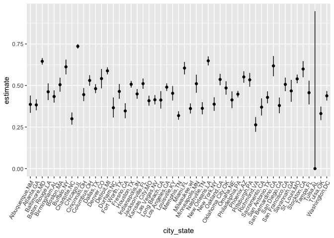
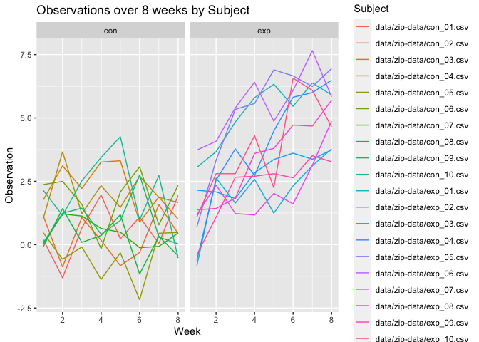
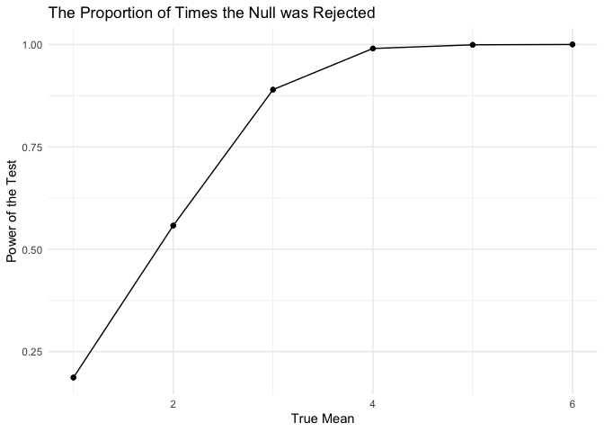

p8105_hw5_rc3520
================
Ruyi Chen
2023-11-14

\#Problem 1

``` r
homicide = 
  read_csv("data/homicide-data.csv") |>
  janitor::clean_names()|>
  mutate(city_state = paste(city, state, sep = ","))
```

    ## Rows: 52179 Columns: 12
    ## ── Column specification ────────────────────────────────────────────────────────
    ## Delimiter: ","
    ## chr (9): uid, victim_last, victim_first, victim_race, victim_age, victim_sex...
    ## dbl (3): reported_date, lat, lon
    ## 
    ## ℹ Use `spec()` to retrieve the full column specification for this data.
    ## ℹ Specify the column types or set `show_col_types = FALSE` to quiet this message.

``` r
view(homicide)
```

``` r
homicide_city_state =
  homicide |>
  group_by(city_state, disposition) |>
  count(disposition) |>
  pivot_wider(
    names_from = disposition,
    values_from = n
  ) |>
  janitor::clean_names()|>
  mutate_all(~coalesce(., 0))|>
  mutate(total_homicide = closed_without_arrest + open_no_arrest + closed_by_arrest,
    unsolved_homicide = closed_without_arrest + open_no_arrest)
```

    ## `mutate_all()` ignored the following grouping variables:
    ## • Column `city_state`
    ## ℹ Use `mutate_at(df, vars(-group_cols()), myoperation)` to silence the message.

``` r
homicide_city_state
```

    ## # A tibble: 51 × 6
    ## # Groups:   city_state [51]
    ##    city_state     closed_by_arrest closed_without_arrest open_no_arrest
    ##    <chr>                     <dbl>                 <dbl>          <dbl>
    ##  1 Albuquerque,NM              232                    52             94
    ##  2 Atlanta,GA                  600                    58            315
    ##  3 Baltimore,MD               1002                   152           1673
    ##  4 Baton Rouge,LA              228                    16            180
    ##  5 Birmingham,AL               453                    64            283
    ##  6 Boston,MA                   304                     0            310
    ##  7 Buffalo,NY                  202                     8            311
    ##  8 Charlotte,NC                481                    44            162
    ##  9 Chicago,IL                 1462                   387           3686
    ## 10 Cincinnati,OH               385                    49            260
    ## # ℹ 41 more rows
    ## # ℹ 2 more variables: total_homicide <dbl>, unsolved_homicide <dbl>

``` r
baltimore_homicide =
  homicide_city_state |>
  filter(city_state == "Baltimore,MD")
baltimore_homicide
```

    ## # A tibble: 1 × 6
    ## # Groups:   city_state [1]
    ##   city_state   closed_by_arrest closed_without_arrest open_no_arrest
    ##   <chr>                   <dbl>                 <dbl>          <dbl>
    ## 1 Baltimore,MD             1002                   152           1673
    ## # ℹ 2 more variables: total_homicide <dbl>, unsolved_homicide <dbl>

``` r
prop_test_result =
  prop.test(
  x = baltimore_homicide$unsolved_homicide,
  n = baltimore_homicide$total_homicide
  ) |>
  broom::tidy() 

prop_test_result |>
  knitr::kable()
```

|  estimate | statistic | p.value | parameter |  conf.low | conf.high | method                                               | alternative |
|----------:|----------:|--------:|----------:|----------:|----------:|:-----------------------------------------------------|:------------|
| 0.6455607 |   239.011 |       0 |         1 | 0.6275625 | 0.6631599 | 1-sample proportions test with continuity correction | two.sided   |

\##The proportion of homicides that are unsolved in Baltimore is around
64.55607% (CI: 62.75625%, 66.31599%).

``` r
prop_test = function (city_name) {
    prop.test(
  x = homicide_city_state$unsolved_homicide[homicide_city_state$city_state == city_name ],
  n = homicide_city_state$total_homicide[homicide_city_state$city_state == city_name ]
  ) |>
    broom::tidy()}

purrr::map_df(pull(homicide_city_state, city_state), prop_test)
```

    ## Warning in prop.test(x =
    ## homicide_city_state$unsolved_homicide[homicide_city_state$city_state == :
    ## Chi-squared approximation may be incorrect

    ## # A tibble: 51 × 8
    ##    estimate statistic   p.value parameter conf.low conf.high method  alternative
    ##       <dbl>     <dbl>     <dbl>     <int>    <dbl>     <dbl> <chr>   <chr>      
    ##  1    0.386   19.1    1.23e-  5         1    0.337     0.438 1-samp… two.sided  
    ##  2    0.383   52.5    4.32e- 13         1    0.353     0.415 1-samp… two.sided  
    ##  3    0.646  239.     6.46e- 54         1    0.628     0.663 1-samp… two.sided  
    ##  4    0.462    2.27   1.32e-  1         1    0.414     0.511 1-samp… two.sided  
    ##  5    0.434   13.8    2.05e-  4         1    0.399     0.469 1-samp… two.sided  
    ##  6    0.505    0.0407 8.40e-  1         1    0.465     0.545 1-samp… two.sided  
    ##  7    0.612   25.8    3.73e-  7         1    0.569     0.654 1-samp… two.sided  
    ##  8    0.300  109.     1.41e- 25         1    0.266     0.336 1-samp… two.sided  
    ##  9    0.736 1231.     1.28e-269         1    0.724     0.747 1-samp… two.sided  
    ## 10    0.445    8.11   4.41e-  3         1    0.408     0.483 1-samp… two.sided  
    ## # ℹ 41 more rows

``` r
city = data.frame(city_state = homicide_city_state$city_state)
prob_test_city_state = purrr::map_df(pull(homicide_city_state, city_state), prop_test)
```

    ## Warning in prop.test(x =
    ## homicide_city_state$unsolved_homicide[homicide_city_state$city_state == :
    ## Chi-squared approximation may be incorrect

``` r
prob_city_state = bind_cols(city, prob_test_city_state) 

prob_city_state = arrange(prob_city_state, estimate)

view(prob_city_state)

ggplot(prob_city_state, aes(x = city_state, y = estimate)) +
  geom_point() +
  geom_errorbar(aes(ymin = conf.low, ymax = conf.high), width = 0.1) +
  theme(axis.text.x = element_text(angle = 60, hjust = 1))
```

<!-- -->

\#Problem 2

``` r
file_paths=tibble(
  files_name=list.files(path="data/zip-data", pattern = "*.csv",full.names = TRUE))  |> 
  mutate(data=map(files_name,read.csv)) 
zip_final =
  file_paths |>
  unnest(everything()) |>
  mutate(
    id = as.numeric(gsub("\\D", "", files_name)),
    arm = substr(files_name, start = 15, stop = 17)
  )|>
  select(files_name,id, arm, everything())|>
  pivot_longer(
    cols=starts_with("week"),
    names_to = "week",
    values_to ="obs"
  )|>
mutate(week = as.numeric(gsub("\\D", "", week)))
view(zip_final)
```

\##Make a spaghetti plot showing observations on each subject over time,
and comment on differences between groups

``` r
ggplot(zip_final,aes(x = week, y = obs, color = files_name),data_df) +
  geom_line()+
  facet_wrap(.~arm)+
  labs(
    title="Observations over 8 weeks by Subject",
    x="Week",
    y="Observation",
    color = "Subject"
    )
```

<!-- -->

\#Problem 3 \##set the design elements and generate 5000 datasets from
the model

``` r
pvalue_estimate_sim = function(mu, n = 30,sigma = 5) {
  data_simulation = tibble(x = rnorm(n = 30, mean = mu, sd = sigma)) |>
    t.test() |>  
    broom::tidy() |>  
    select(estimate, p.value)
  }

expand_grid(population_mean = 0, time = 1:5000) |> 
  mutate(result_df = map(population_mean, pvalue_estimate_sim)) |> 
  unnest(result_df)
```

    ## # A tibble: 5,000 × 4
    ##    population_mean  time  estimate p.value
    ##              <dbl> <int>     <dbl>   <dbl>
    ##  1               0     1  0.000286  1.00  
    ##  2               0     2 -0.368     0.545 
    ##  3               0     3 -0.944     0.359 
    ##  4               0     4 -1.62      0.0595
    ##  5               0     5  1.38      0.111 
    ##  6               0     6 -1.10      0.151 
    ##  7               0     7  0.443     0.587 
    ##  8               0     8 -0.324     0.742 
    ##  9               0     9 -1.03      0.336 
    ## 10               0    10 -1.46      0.168 
    ## # ℹ 4,990 more rows

\##Repeat the above for μ={1,2,3,4,5,6}

``` r
mean_6 =
  expand_grid(population_mean = 1:6, time = 1:5000) |> 
  mutate(result_df = map(population_mean, pvalue_estimate_sim)) |> 
  unnest(result_df)
```

``` r
ggplot_mean_6 =
  mean_6|>
  filter(p.value < 0.05) |>
  group_by(population_mean) |>
  count() |>
  mutate(proportion = n / 5000)

ggplot(ggplot_mean_6,aes(x = population_mean, y = proportion)) +
  geom_point() + 
  geom_line() +
  geom_point() +
  theme_minimal() +
  labs(x = "True Mean", y = "Power of the Test", title = "The Proportion of Times the Null was Rejected")
```

<!-- -->
